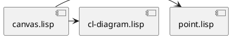

<!-- define: APPNAME = diagram -->
<!-- define: BLANK_PARAGRAPH = '　　' -->
<!-- define: TODO = '@((background:red;color:white;)(ToDo : %1))' -->

<!-- title:${APPNAME} internal -->    
<!-- style:./default.css -->			
<!-- <!-- config:term-link-in-header -->			

<!-- filter:diagram  = bash ./diagram.sh  %in %out -->
<!-- filter:plantuml = bash ./plantuml.sh %in %out -->

<!-- config:write-comment -->			
<!-- config:header-numbering 2 4 -->			

# ${APPNAME} internal documents

　この文書は、 **${APPNAME}** の内部設計文書です。


## Table of contents

<!-- embed:toc 2 4 -->

${BLANK_PARAGRAPH}

## src 配下のコンポーネント

### arc.lisp
### binutil.lisp
### canvas.lisp



### circle.lisp
### cl-diagram.asd
### cl-diagram.lisp
### connector.lisp
### constants.lisp
### create-svg.lisp
### dictionary.lisp
### ellipse.lisp
### endmark-info.lisp
### entity.lisp
### fill-info.lisp
### font-info.lisp
### group.lisp
### image.lisp
### label-info.lisp
### layer-manager.lisp
### line.lisp
### link-info.lisp
### mathutil.lisp
### paragraph.lisp
### path.lisp
### pathutil.lisp
### point.lisp

　${APPNAME} の座標は point を使って表現します。これは基本的に 2 要素の数値のリストで、
通常は make-point 関数で作成します。

```lisp
 (make-point 1 2) ; => (1 2)
```

　実際には、座標には __絶対座標__ と __相対座標__ があり、それを指定するための `&optional` 
パラメータが存在します。

```lisp
 (make-point 1 2 :absolute) ; => (1 2 . :absolute)
```

#### make-point 関数
<!-- autolink: [$$](#make-point 関数) -->

　`point` を作成するには、x, y を指定して `make-point` 関数をコールします。
オプションで `:abosolute` か `:relative` を指定できます。省略した場合は 
`:relative` になります。これらは絶対座標か相対座標の区別です。

```lisp
(defun make-point (x y &optional type) ... )
```

#### copy-point 関数

<!-- autolink: [$$](#copy-point 関数) -->

　`point` を複製するには `copy-point` 関数を使ってください。

```lisp
(defun copy-point (pt) ... )
```

#### point-p 関数

<!-- autolink: [$$](#point-p 関数) -->

```lisp
(defun point-p (pt) ... )
```

#### point-absolute-p 関数

<!-- autolink: [$$](#point-absolute-p 関数) -->

```lisp
(defun point-absolute-p (pt) ... )
```

#### point-relative-p 関数

<!-- autolink: [$$](#point-relative-p 関数) -->

```lisp
(defun point-relative-p (pt) ... )
```

#### point-x 関数

<!-- autolink: [$$](#point-x 関数) -->

```lisp
(defun point-x (pt) ... )
(defun (setf point-x) (val pt) ... )
```

#### point-y 関数

<!-- autolink: [$$](#point-y 関数) -->

```lisp
(defun point-y (pt) ... )
(defun (setf point-y) (val pt) ... )
```

#### point+ 関数

<!-- autolink: [$$](#point+ 関数) -->

```lisp
(defun point+ (pt1 pt2) ... )
```

#### point- 関数

<!-- autolink: [$$](#point- 関数) -->

```lisp
(defun point- (pt1 pt2) ... )
```

#### point/x+ 関数

<!-- autolink: [$$](#point/x+ 関数) -->

```lisp
(defun point/x+ (pt x) ... )
```

#### point/y+ 関数

<!-- autolink: [$$](#point/y+ 関数) -->

```lisp
(defun point/y+ (pt y) ... )
```

#### point/xy+ 関数

<!-- autolink: [$$](#point/xy+ 関数) -->

```lisp
(defun point/xy+ (pt x y) ... )
```

#### point-distance 関数

<!-- autolink: [$$](#point-distance 関数) -->

　2 つの `point` 間の距離は `point-distance` 関数で測ることができます。

```lisp
(defun point-distance (pt1 pt2) ... )
```


#### with-point マクロ

<!-- autolink: [$$](#with-point マクロ) -->

　`point` の x, y に `symbol-macrolet` でアクセスしたければ `with-point` マクロが
使えます。

```lisp
(defmacro with-point ((sym-x sym-y) pt &rest body) ... )
```

${BLANK_PARAGRAPH}

### polygon.lisp
### raw-svg.lisp
### rectangle.lisp
### shape.lisp
### stencil.lisp
### stroke-info.lisp
### stylesheet.lisp
### text-shape.lisp
### text.lisp
### writer.lisp

--------------------------------------------------------------------------------

<!-- embed:footnotes -->

